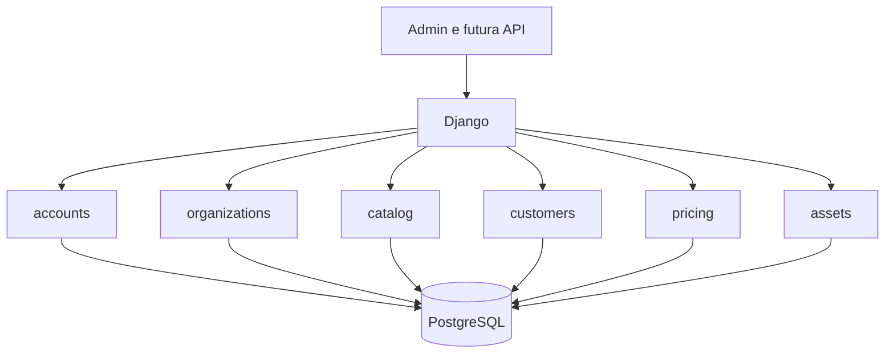

# Arquitetura da aplicação

## Visão geral

A Rental Platform é um monólito modular Django. Existe um único processo de aplicação
e um único banco relacional, enquanto os módulos preservam limites claros de domínio.
Essa estrutura reduz hospedagem, rede, monitoramento e complexidade transacional no
início do produto sem impedir uma futura separação baseada em evidências.

## Módulos

| Módulo | Responsabilidade atual | Não deve assumir |
|---|---|---|
| `accounts` | identidade e autenticação | dados de cliente ou regras de locação |
| `organizations` | tenant, estabelecimentos e acesso interno | catálogo e preços |
| `catalog` | classificação, modelo comercial e ativo físico | contratos e pagamentos |
| `customers` | pessoas físicas/jurídicas, contatos e endereços | reservas e contratos |
| `pricing` | versões e cálculo elementar de preços | disponibilidade, descontos e contratos |
| `assets` | dados patrimoniais vinculados à unidade física | depreciação e contabilidade |
| `common` | primitivas técnicas realmente compartilhadas | regras específicas de um módulo |
| `config` | composição, URLs, ambientes e inicialização | lógica de negócio |

`catalog` depende conceitualmente de `organizations`: categorias, modelos e unidades
pertencem a uma organização; unidades também pertencem a um estabelecimento. A
dependência inversa não existe. `customers` também depende de `organizations`, mas não
depende de `catalog`; reservas futuras serão responsáveis por relacionar os domínios.
`pricing` depende de `catalog` e `organizations`, pois cada política precifica um modelo
de ferramenta dentro do mesmo tenant. `assets` também depende de `catalog` e
`organizations`: ele complementa cada unidade física com dados patrimoniais, sem fazer
o catálogo assumir regras contábeis.

## Isolamento por organização

O modelo de tenancy é schema compartilhado: todas as organizações usam as mesmas
tabelas e cada registro de negócio possui `organization_id`. É barato e adequado ao
estágio atual, mas exige filtros explícitos em toda leitura e escrita futura.

Invariantes já implementadas:

- nomes de categoria são únicos dentro da organização;
- modelos só aceitam categorias da mesma organização;
- códigos patrimoniais são únicos dentro da organização;
- unidades só aceitam modelo e estabelecimento da mesma organização;
- existe no máximo uma matriz ativa por organização;
- o mesmo CPF ou CNPJ não se repete dentro da organização;
- endereços não podem relacionar clientes de outra organização;
- existe no máximo um endereço principal ativo por cliente;
- políticas não podem relacionar modelos de outra organização;
- cada modelo possui no máximo uma versão de preço por data de vigência;
- toda política oferece ao menos um valor não negativo por hora, dia ou mês;
- cada unidade possui no máximo um perfil patrimonial;
- perfil patrimonial e unidade pertencem à mesma organização;
- valor residual não supera o custo de aquisição;
- entrada em operação não antecede a aquisição;
- vida útil patrimonial é positiva.

O Django Admin atual é uma ferramenta interna de bootstrap e não representa ainda
isolamento completo de tenant na interface. Antes de uso por clientes reais, os
querysets e formulários deverão ser filtrados pela organização do usuário autenticado.

## Persistência

- PostgreSQL é o banco de produção, Docker e integração contínua.
- SQLite é permitido somente como conveniência local.
- Identificadores de domínio usam UUID para reduzir acoplamento com sequências globais
  e facilitar futuras integrações.
- Datas são armazenadas com timezone; a apresentação usa `America/Sao_Paulo`.
- Valores financeiros usam decimal com duas casas.

As regras são aplicadas em duas camadas quando útil:

1. `clean()` e `full_clean()` geram erros compreensíveis antes da escrita;
2. constraints do banco protegem concorrência e escritas que não passam pelo modelo.

`QuerySet.update()`, SQL direto e importações em lote não chamam `save()`; esses caminhos
devem validar seus próprios dados e continuam protegidos apenas pelas constraints.

## Caminho de evolução

| Versão | Resultado principal |
|---|---|
| `0.1.x` | fundação operacional, organizações e catálogo |
| `0.2.0` | clientes e endereços |
| `0.2.1` | política de preço por hora, dia e mês |
| `0.2.2` | base patrimonial dos ativos |
| `0.3.x` | orçamentos, reservas e disponibilidade |
| `0.4.x` | contratos, retirada, devolução e inspeção |
| `0.5.x` | depreciação de ativos |
| `0.6.x` | checkout hospedado e webhooks |
| `0.7.x` | aplicativo móvel e IA assistiva |

Preço é uma política versionada, não apenas três colunas soltas. A versão ativa mais
recente já vigente substitui implicitamente a anterior. Mês-calendário e quantidade
fixa de dias são configurações explícitas; a conversão de um período real em unidades
será responsabilidade do fluxo de orçamento.

A v0.2.2 registra somente a base patrimonial necessária: aquisição, entrada em
operação, custo, valor residual e vida útil. O valor depreciável exposto pelo domínio é
apenas `custo - valor residual`. Método, competência, depreciação acumulada, impairment
e revisão de estimativas continuam reservados à v0.5 e dependerão também dos eventos
operacionais que ainda serão modelados.

IA deverá consumir serviços internos com saídas estruturadas. O banco e as regras
determinísticas continuarão sendo a fonte de verdade.
