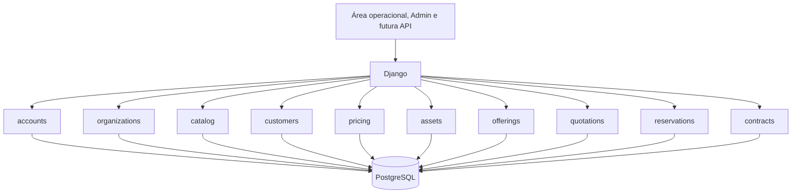

# Arquitetura da aplicação

## Visão geral

A Rental Platform é um monólito modular Django. Existe um único processo de aplicação
e um único banco relacional, enquanto os módulos preservam limites claros de domínio.
Essa estrutura reduz hospedagem, rede, monitoramento e complexidade transacional no
início do produto sem impedir uma futura separação baseada em evidências.

## Módulos

| Módulo | Responsabilidade atual | Não deve assumir |
|---|---|---|
| `accounts` | identidade e autenticação | dados de cliente ou regras de locação |
| `organizations` | tenant, estabelecimentos e acesso interno | catálogo e preços |
| `catalog` | classificação, modelo comercial e ativo físico | contratos e pagamentos |
| `customers` | pessoas físicas/jurídicas, contatos e endereços | reservas e contratos |
| `pricing` | versões e cálculo elementar de preços | disponibilidade, descontos e contratos |
| `assets` | dados patrimoniais vinculados à unidade física | depreciação e contabilidade |
| `offerings` | configurações, compatibilidade, preço e saldo consumível | texto livre, inspeção e cobrança |
| `quotations` | períodos, itens, snapshots e estados | estoque, reservas e contratos |
| `reservations` | disponibilidade temporal e alocação física | contratos, retirada e devolução |
| `contracts` | contrato, retirada, devolução e condição observada | preço, cobrança e pagamentos |
| `common` | primitivas técnicas realmente compartilhadas | regras específicas de um módulo |
| `config` | composição, URLs, ambientes e inicialização | lógica de negócio |

`catalog` depende conceitualmente de `organizations`: categorias, modelos e unidades
pertencem a uma organização; unidades também pertencem a um estabelecimento. A
dependência inversa não existe. `customers` também depende de `organizations`, mas não
depende de `catalog`; reservas futuras serão responsáveis por relacionar os domínios.
`pricing` depende de `catalog` e `organizations`, pois cada política precifica um modelo
de ferramenta dentro do mesmo tenant. `assets` também depende de `catalog` e
`organizations`: ele complementa cada unidade física com dados patrimoniais, sem fazer
o catálogo assumir regras contábeis. `quotations` relaciona `customers`, `catalog`,
`pricing` e `organizations`. Ele compõe esses domínios sem transferir cálculo de período
para o catálogo ou disponibilidade para preços.
`reservations` consome orçamentos enviados e relaciona suas linhas a unidades físicas
de um estabelecimento. Ele não recalcula preços e não transforma reserva em contrato.
`contracts` consome uma reserva confirmada e preserva os dados necessários para operar
retirada e devolução. Ele não recalcula o orçamento nem decide disponibilidade.
`offerings` define opções estruturadas reutilizadas por orçamento, reserva e contrato;
o módulo não interpreta observações livres nem decide avarias.

## Isolamento por organização

O modelo de tenancy é schema compartilhado: todas as organizações usam as mesmas
tabelas e cada registro de negócio possui `organization_id`. É barato e adequado ao
estágio atual, mas exige filtros explícitos em toda leitura e escrita futura.

Invariantes já implementadas:

- nomes de categoria são únicos dentro da organização;
- modelos só aceitam categorias da mesma organização;
- códigos patrimoniais são únicos dentro da organização;
- cada organização possui uma única sequência positiva de códigos internos;
- unidades só aceitam modelo e estabelecimento da mesma organização;
- existe no máximo uma matriz ativa por organização;
- o mesmo CPF ou CNPJ não se repete dentro da organização;
- endereços não podem relacionar clientes de outra organização;
- existe no máximo um endereço principal ativo por cliente;
- políticas não podem relacionar modelos de outra organização;
- cada modelo possui no máximo uma versão de preço por data de vigência;
- toda política oferece ao menos um valor não negativo por hora, dia ou mês;
- cada unidade possui no máximo um perfil patrimonial;
- perfil patrimonial e unidade pertencem à mesma organização;
- valor residual não supera o custo de aquisição;
- entrada em operação não antecede a aquisição;
- vida útil patrimonial é positiva.
- cliente, itens, modelos e políticas de um orçamento compartilham a organização;
- o fim do orçamento é posterior ao início;
- quantidades de equipamentos e período são positivas;
- tarifa e total do snapshot não são negativos.
- cada orçamento possui no máximo uma reserva;
- reserva, orçamento, estabelecimento, item e equipamento compartilham tenant;
- o período da alocação é o mesmo da reserva e do orçamento;
- uma unidade não possui alocações ativas sobrepostas no PostgreSQL;
- alocações canceladas permanecem registradas e deixam de bloquear disponibilidade.
- cada reserva possui no máximo um contrato;
- contrato, reserva, cliente, estabelecimento, itens e equipamentos compartilham tenant;
- cada equipamento alocado aparece no máximo uma vez no contrato;
- retirada e devolução registram usuário e horário por unidade física;
- devolução integral conclui o contrato, enquanto devolução parcial o mantém ativo.
- adicional, compatibilidade, preço e estoque nunca atravessam organizações;
- acessórios físicos compartilham a agenda de `ToolUnit` e consumíveis usam saldo
  bloqueado por estabelecimento;
- seleções estruturadas permanecem imutáveis após o envio do orçamento.

### Adicionais configuráveis

`Offering` separa cinco categorias: configuração, acessório retornável, consumível,
serviço e remoção com desconto. `OfferingCompatibility` restringe modelos e quantidade;
`OfferingPricingPolicy` versiona valor único ou por período; `OfferingStock` controla
saldo físico e reservado de consumíveis por estabelecimento.

O orçamento guarda `QuotationItemOffering` como memória de cálculo. Na confirmação,
opções físicas recebem alocações e consumíveis são reservados com bloqueio de linha.
`ReservationOffering` preserva o compromisso; `ContractOffering` preserva a contratação.
Na retirada, consumíveis são baixados e unidades retornáveis passam para `RENTED`.

### Contexto operacional ativo

`ActiveOrganizationMiddleware` resolve `request.organization` somente a partir de
`Membership` e da sessão autenticada. Um identificador adulterado, vínculo inativo ou
organização inativa é descartado. Quando existe um único vínculo ativo, o contexto é
selecionado automaticamente; múltiplos vínculos exigem escolha explícita.

O onboarding cria `Organization`, matriz e vínculo `OWNER` dentro da mesma transação.
Não há migration neste incremento porque o fluxo usa as tabelas existentes. A nova
área `/app/` é a fundação operacional; os próximos formulários devem obter o tenant do
request e filtrar todos os relacionamentos por ele.

O Django Admin permanece uma ferramenta técnica de bootstrap e não aplica esse escopo
automaticamente. Ele não deve ser oferecido como interface normal ao cliente.

### Cadastro assistido de ferramentas

`create_tool_batch()` é a fronteira transacional do cadastro operacional. O serviço
bloqueia a linha de `Organization` com `select_for_update()`, reserva uma faixa em
`AssetCodeSequence` e cria categoria, modelo, política de preço opcional, equipamentos
e perfis patrimoniais opcionais dentro da mesma transação.

O bloqueio na organização também protege a primeira criação da sequência. Dois lotes
concorrentes da mesma locadora esperam um pelo outro e recebem faixas distintas; lotes
de locadoras diferentes continuam independentes. A unicidade composta de `ToolUnit`
permanece como defesa adicional no banco.

A interface nunca recebe `organization`. Categorias e estabelecimentos são filtrados
por `request.organization`; uma única unidade é selecionada automaticamente e, quando
há filiais, a matriz é a sugestão inicial. Cada equipamento nasce como `AVAILABLE`.
Dados comuns de aquisição só geram perfis após confirmação explícita do usuário.

Na listagem operacional, `AVAILABLE` significa **Apta para locação**, não ausência de
compromisso temporal. A view compõe catálogo e reservas em duas consultas: uma para os
equipamentos e outra para alocações ativas atuais ou futuras. A tela mostra condição e
agenda separadamente, sem criar dependência de reservas dentro do modelo de catálogo.

### Orçamento reproduzível

`save_draft_quotation()` é a fronteira transacional para criar e substituir um
rascunho. Cliente e modelos são consultados novamente dentro da organização ativa. A
política selecionada é a versão ativa mais recente já vigente no início da locação e
fica bloqueada durante a captura do snapshot.

O intervalo usa a convenção `[início, fim)`: o instante inicial pertence à locação e o
instante final não. Horas usam duração exata; dias equivalem a 24 horas; mês fixo divide
pelos dias configurados; mês-calendário conta aniversários do início e transforma o
restante em fração do próximo mês. Depois, a política decide entre arredondar a fração
para cima ou mantê-la proporcional.

`QuotationItem` guarda quantidade exata, quantidade cobrada, tarifa, total, vigência,
arredondamento e definição de mês. Alterar uma `PricingPolicy` não reescreve snapshots.
Somente `DRAFT` pode ser editado ou recalculado; `SENT`, `EXPIRED` e `CANCELLED`
preservam os itens. Orçamento não escolhe `ToolUnit` nem reserva estoque. A transição
para `SENT`, porém, consulta a disponibilidade corrente e exige que ao menos um
estabelecimento ativo possa atender todas as linhas.

### Disponibilidade e reserva

`available_units()` combina a condição operacional de `ToolUnit` com a agenda de
`ReservationAllocation`. Somente unidades `AVAILABLE` do estabelecimento e modelo
solicitados são candidatas. Existe conflito quando uma alocação ativa satisfaz
`existente.início < novo.fim` e `existente.fim > novo.início`; por isso intervalos que
apenas encostam podem compartilhar a mesma unidade.

`available_establishments_for_quotation()` soma quantidades do mesmo modelo e retorna
somente estabelecimentos capazes de atender o orçamento completo. Ela protege o envio
de uma oferta sabidamente inviável e restringe as opções da confirmação, mas não cria
alocações; a disponibilidade ainda pode mudar até `confirm_reservation()`.

`units_with_reservation_schedule()` anexa a cada equipamento a alocação vigente e a
próxima futura, ignorando alocações liberadas e outros tenants. A composição usa
`Prefetch`, mantendo duas consultas independentemente da quantidade de equipamentos.

`confirm_reservation()` aceita somente orçamento `SENT`, bloqueia orçamento,
estabelecimento e unidades candidatas, seleciona equipamentos específicos e grava
reserva e alocações na mesma transação. O PostgreSQL usa `btree_gist` e uma constraint
de exclusão sobre `tool_unit_id` e `TSTZRANGE(..., '[)')` como defesa definitiva contra
duas confirmações simultâneas. Em SQLite essa constraint não existe; o ambiente local
serve para comportamento funcional, enquanto a CI PostgreSQL valida concorrência real.

`cancel_reservation()` é a única transição atual: `CONFIRMED → CANCELLED`. Ela registra
um único instante em reserva e alocações. `released_at` retira a alocação da condição da
constraint e libera o período sem apagar qual equipamento havia sido separado. O estado
de `ToolUnit` não muda, pois ele representa condição operacional, não agenda futura.

Enquanto existir reserva confirmada, o orçamento não pode ser expirado ou cancelado.
Primeiro a reserva deve liberar suas alocações; os snapshots comerciais permanecem
inalterados em todos os casos.

## Persistência

- PostgreSQL é o banco de produção, Docker e integração contínua.
- SQLite é permitido somente como conveniência local.
- Identificadores de domínio usam UUID para reduzir acoplamento com sequências globais
  e facilitar futuras integrações.
- Datas são armazenadas com timezone; a apresentação usa `America/Sao_Paulo`.
- Valores financeiros usam decimal com duas casas.

As regras são aplicadas em duas camadas quando útil:

1. `clean()` e `full_clean()` geram erros compreensíveis antes da escrita;
2. constraints do banco protegem concorrência e escritas que não passam pelo modelo.

`QuerySet.update()`, SQL direto e importações em lote não chamam `save()`; esses caminhos
devem validar seus próprios dados e continuam protegidos apenas pelas constraints.

## Caminho de evolução

| Versão | Resultado principal |
|---|---|
| `0.1.x` | fundação operacional, organizações e catálogo |
| `0.2.0` | clientes e endereços |
| `0.2.1` | política de preço por hora, dia e mês |
| `0.2.2` | base patrimonial dos ativos |
| `0.3.x` | contexto da locadora, cadastro assistido, orçamentos e reservas |
| `0.4.x` | contratos, retirada, devolução e inspeção |
| `0.5.x` | depreciação de ativos |
| `0.6.x` | checkout hospedado e webhooks |
| `0.7.x` | aplicativo móvel e IA assistiva |

Preço é uma política versionada, não apenas três colunas soltas. A versão ativa mais
recente já vigente substitui implicitamente a anterior. Mês-calendário e quantidade
fixa de dias são configurações explícitas; a conversão de um período real em unidades
é responsabilidade do fluxo de orçamento e fica registrada no snapshot.

A v0.2.2 registra somente a base patrimonial necessária: aquisição, entrada em
operação, custo, valor residual e vida útil. O valor depreciável exposto pelo domínio é
apenas `custo - valor residual`. Método, competência, depreciação acumulada, impairment
e revisão de estimativas continuam reservados à v0.5 e dependerão também dos eventos
operacionais que ainda serão modelados.

IA deverá consumir serviços internos com saídas estruturadas. O banco e as regras
determinísticas continuarão sendo a fonte de verdade.
