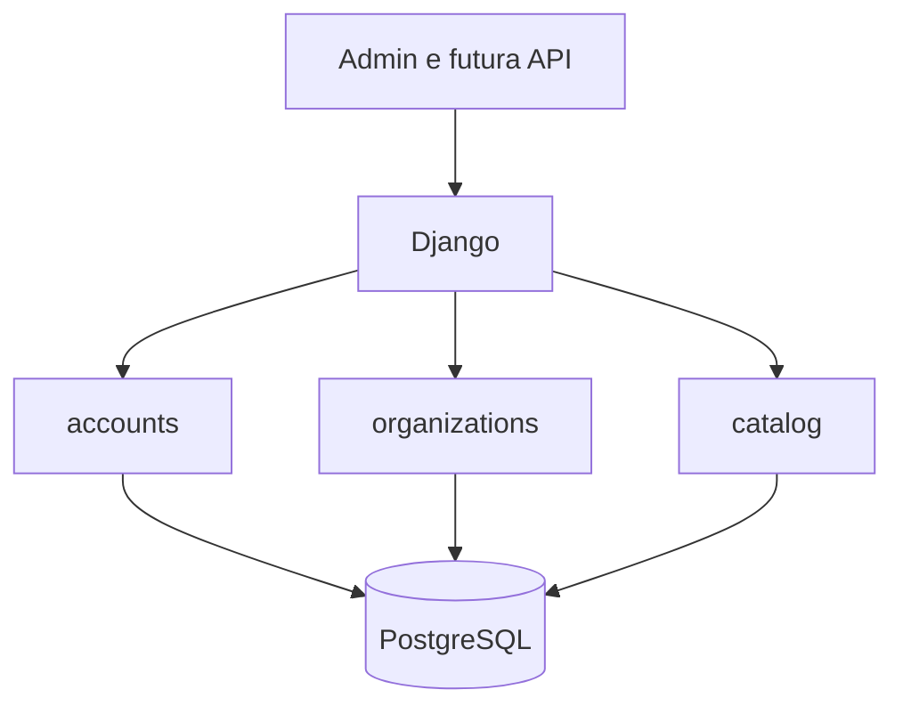

# Arquitetura da aplicação

## Visão geral

A Rental Platform é um monólito modular Django. Existe um único processo de aplicação
e um único banco relacional, enquanto os módulos preservam limites claros de domínio.
Essa estrutura reduz hospedagem, rede, monitoramento e complexidade transacional no
início do produto sem impedir uma futura separação baseada em evidências.

## Módulos

| Módulo | Responsabilidade atual | Não deve assumir |
|---|---|---|
| `accounts` | identidade e autenticação | dados de cliente ou regras de locação |
| `organizations` | tenant, estabelecimentos e acesso interno | catálogo e preços |
| `catalog` | classificação, modelo comercial e ativo físico | contratos e pagamentos |
| `common` | primitivas técnicas realmente compartilhadas | regras específicas de um módulo |
| `config` | composição, URLs, ambientes e inicialização | lógica de negócio |

`catalog` depende conceitualmente de `organizations`: categorias, modelos e unidades
pertencem a uma organização; unidades também pertencem a um estabelecimento. A
dependência inversa não existe.

## Isolamento por organização

O modelo de tenancy é schema compartilhado: todas as organizações usam as mesmas
tabelas e cada registro de negócio possui `organization_id`. É barato e adequado ao
estágio atual, mas exige filtros explícitos em toda leitura e escrita futura.

Invariantes já implementadas:

- nomes de categoria são únicos dentro da organização;
- modelos só aceitam categorias da mesma organização;
- códigos patrimoniais são únicos dentro da organização;
- unidades só aceitam modelo e estabelecimento da mesma organização;
- existe no máximo uma matriz ativa por organização.

O Django Admin atual é uma ferramenta interna de bootstrap e não representa ainda
isolamento completo de tenant na interface. Antes de uso por clientes reais, os
querysets e formulários deverão ser filtrados pela organização do usuário autenticado.

## Persistência

- PostgreSQL é o banco de produção, Docker e integração contínua.
- SQLite é permitido somente como conveniência local.
- Identificadores de domínio usam UUID para reduzir acoplamento com sequências globais
  e facilitar futuras integrações.
- Datas são armazenadas com timezone; a apresentação usa `America/Sao_Paulo`.
- Valores financeiros usam decimal com duas casas.

As regras são aplicadas em duas camadas quando útil:

1. `clean()` e `full_clean()` geram erros compreensíveis antes da escrita;
2. constraints do banco protegem concorrência e escritas que não passam pelo modelo.

`QuerySet.update()`, SQL direto e importações em lote não chamam `save()`; esses caminhos
devem validar seus próprios dados e continuam protegidos apenas pelas constraints.

## Caminho de evolução

| Versão | Resultado principal |
|---|---|
| `0.1.x` | fundação operacional, organizações e catálogo |
| `0.2.x` | clientes e endereços |
| `0.3.x` | política de preço por hora, dia e mês |
| `0.4.x` | reservas e disponibilidade |
| `0.5.x` | contratos, retirada, devolução e inspeção |
| `0.6.x` | checkout hospedado e webhooks |
| futura | depreciação de ativos e IA assistiva |

Preço será uma política versionada, não apenas três colunas soltas. O mês deverá
suportar definições configuráveis, como mês-calendário ou quantidade fixa de dias.
Depreciação dependerá de dados patrimoniais e eventos de manutenção; ela não deve ser
calculada antes de esses fatos existirem.

IA deverá consumir serviços internos com saídas estruturadas. O banco e as regras
determinísticas continuarão sendo a fonte de verdade.
