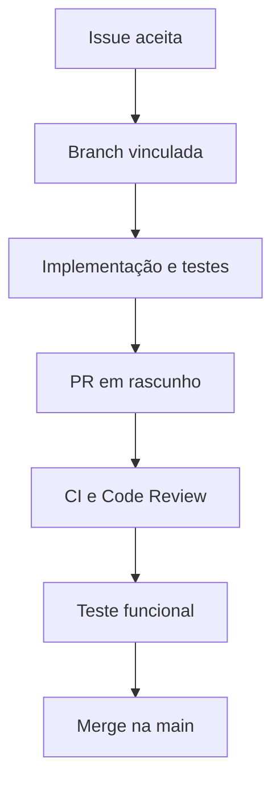

# Fluxo de desenvolvimento e Code Review

## Objetivo

Toda mudança deve ser rastreável desde a necessidade do negócio até o código, os testes
e a documentação. O processo evita alterações amplas sem critério e facilita manutenção
por pessoas e agentes de IA.

## 1. Issue

A Issue é a autorização e a fronteira da mudança. Ela deve conter:

- objetivo observável;
- contexto ou problema;
- escopo em checklist;
- critérios de aceite verificáveis;
- dependências;
- itens explicitamente fora do escopo;
- riscos relevantes quando conhecidos.

Uma Issue está pronta para desenvolvimento quando não depende de uma decisão de produto
em aberto capaz de mudar substancialmente a solução.

## 2. Branch e commits

A branch nasce da `main` atual e usa
`agent/issue-{número}-{descrição}`. Commits devem representar passos coerentes e não
misturar correção, refatoração ampla e funcionalidade sem necessidade.

Arquivos modificados que não atendem à Issue precisam ser retirados do PR ou
justificados claramente.

## 3. Pull Request em rascunho

O PR explica resultado, motivo, impacto, riscos, forma de teste e evidências. A expressão
`Closes #N` vincula a entrega à Issue.

Rascunho significa que o trabalho ainda pode receber commits. “Pronto para revisão”
significa que autorrevisão, CI e evidências já estão completas — não que o merge seja
automático.

## 4. Code Review

| Área | Pergunta principal |
|---|---|
| Produto | os critérios de aceite foram atendidos sem ampliar o escopo? |
| Domínio | as regras estão na camada correta e possuem mensagens compreensíveis? |
| Tenant | toda leitura e escrita respeita a organização ativa? |
| Segurança | entrada não confiável, autorização e segredos foram tratados? |
| Banco | migration, reversibilidade, constraints e concorrência estão seguras? |
| Compatibilidade | dados e comportamentos existentes continuam válidos? |
| Testes | sucesso, falhas e regressões importantes estão cobertos? |
| Operação | configuração, logs, Docker e implantação continuam coerentes? |
| Documentação | código, decisões, versão e contexto de IA concordam? |

Comentários podem ser:

- **bloqueador:** risco de segurança, perda de dados, quebra de regra ou critério ausente;
- **importante:** manutenção, teste ou clareza necessária antes do merge;
- **sugestão:** melhoria útil que pode virar outra Issue.

Discussões devem explicar o risco ou regra envolvida, não apenas preferência de estilo.

## 5. Teste funcional

O responsável pelo produto executa um roteiro reproduzível em ambiente local ou de
homologação e registra:

- caminho testado;
- resultado esperado e observado;
- dados de teste relevantes;
- capturas ou logs quando ajudam;
- aprovação ou defeito encontrado.

Defeitos encontrados no escopo retornam ao mesmo PR. Melhorias novas viram outra Issue.

## 6. Definição de pronto

Uma mudança só pode ser mesclada quando:

- critérios da Issue estão atendidos;
- diff não contém alterações acidentais;
- CI obrigatória passou;
- comentários bloqueadores foram resolvidos;
- migrations e compatibilidade foram verificadas;
- documentação necessária foi atualizada;
- teste funcional foi aprovado;
- PR está vinculada à Issue.

A `main` representa sempre o estado integrado do produto. Branches mescladas podem ser
apagadas; o histórico permanece nas Issues, commits e Pull Requests.
